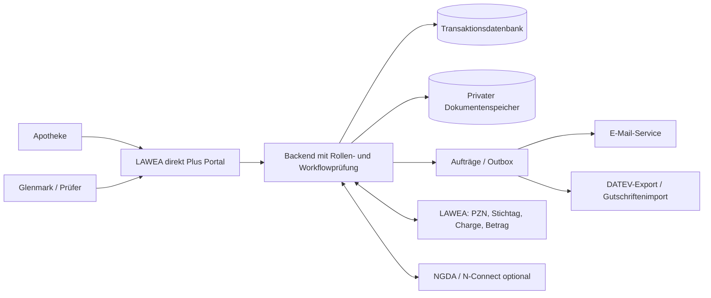

# Technisches Konzept für die Implementierung

## Architekturentscheidung für den Projektstart

Ein **modularer Web-Monolith** mit klaren Fachmodulen ist für den Start angemessen: Portal-UI, Backend-API, Authentifizierung, Registrierungsprüfung, Meldungen, Regelwerk, Dokumente, Glenmark-Workflow und Abwicklung bleiben in einem deploybaren Produkt, aber mit expliziten Schnittstellen. Hintergrundaufträge verarbeiten E-Mail, LAWEA-Wiederholung, Exporte und Importe. Eine relationale Datenbank hält Transaktionen und Audit-Metadaten; Dokumente liegen verschlüsselt in einem privaten Objektspeicher. Externe Systeme werden über austauschbare Adapter angebunden.

**Implementierungsannahme, nicht Quellvorgabe:** TypeScript für Frontend und Backend, React-basierte Weboberfläche, PostgreSQL und privater Objektspeicher. Die implementierende Instanz soll konkrete Framework-/Hostingversionen anhand des tatsächlichen Zielbetriebs festlegen und dokumentieren. Ein lokal startbarer Demo-Modus mit synthetischen Daten und Mock-Adaptern ist Pflicht; Mock-Antworten dürfen niemals als produktive LAWEA- oder Glenmark-Prüfung erscheinen.

## Module und Verantwortlichkeiten

| Modul | Verantwortung | Quelle der Wahrheit |
| --- | --- | --- |
| Identity | Benutzer, Passwort, MFA, Sitzungen, Einladungen | Portal für Zugang; N-Connect optional als bestätigte externe Identität |
| Organization | Apothekenstammdaten, Nachweis, Freigabe, Mitarbeiter | Portal, mit gekennzeichneter NGDA-Quelle für übernommene Daten |
| Campaign/Term | Glenmark-PZN-Katalog, Senkungstermine und Einreichungsfenster als synchronisierte Sicht | LAWEA bzw. vertraglich festgelegte Schnittstelle |
| Claim | Meldungen, Positionen, Revisionen, Erklärungen, Status | Portal; fachliche Preis-/Chargenresultate aus LAWEA |
| Rules/Review | formale Prüfung, konfigurierbare Regeln, Arbeitsvorrat, Entscheidungen | Portal-Regelversion plus LAWEA-Prüfergebnis |
| Documents | Betriebserlaubnis, Belege, Gutschriften, Versionen und Zugriff | privater Speicher mit Portal-Metadaten |
| Settlement | Exportläufe, Importjobs, Zuordnung und Veröffentlichungen | Portal, externe DATEV-Buchung außerhalb des Systems |
| Notification/Audit | Versandaufträge, Ereignisse, manipulationsgeschützte Nachvollziehbarkeit | Portal |

## Zentrale Datenobjekte und Mindestfelder

- `Organization`: `id`, Typ (`PHARMACY`, später ggf. `WHOLESALER`), Name, Adresse, Inhaber, Telefon, verschlüsselte IBAN, optional Homepage, Verifizierungsquelle, Verifizierungsstatus, Freigabezeitpunkt, externe Referenzen.
- `User`: `id`, `organization_id`, Name, normalisierte E-Mail, Passwort-Hash oder föderierter Identitätsbezug, Aktiv-/MFA-Status, letzter Login. `Membership` enthält Rolle und Status; eine E-Mail kann bei freigegebener Strategie mehreren Organisationen angehören, aktive Organisation wird explizit gewählt.
- `Invitation`/`VerificationChallenge`: Empfänger, Zweck, gehashter Token/Code, Ablauf, Versuche, Einlader, Verbrauchszeitpunkt.
- `ReductionTerm`: externer Schlüssel, Stichtag, Einreichungsbeginn/-ende mit Zeitzone, Kunden-/Mandantenkennung, Status, Synchronisationszeitpunkt.
- `Product`: PZN, Name, Glenmark-Zuordnung, externer Schlüssel, Katalogversion.
- `Claim`: `id`, `organization_id`, `term_id`, Vorgangsnummer, aktuelle Revisionsnummer, Gesamtstatus, Ansprechpartner, optional Kommentar, Erstellung/Änderung. Ein fachlich definierter Schlüssel verhindert versehentliche parallele doppelte Meldungen.
- `ClaimRevision`: `claim_id`, Revisionsnummer, Status, unveränderlicher Snapshot aller Positionen, Erklärungszeitpunkt/-benutzer, Einreichungszeitpunkt/-benutzer, Prüfresultate. Eine neue Revision wird nur aus `REJECTED` eröffnet.
- `ClaimItem`: Revision, PZN, Charge, Packungszahl, LAWEA-Prüfkennung/-version, berechneter Betrag falls geliefert.
- `Document`: Organisation, fachlicher Bezug, Typ, sichere Speicherkennung, Originalname, MIME/Größe, Prüfsumme, Prüfstatus, Version, Uploadzeitpunkt/-benutzer; keine öffentliche Objekt-URL.
- `RuleEvaluation`: Regelversion, Eingangsreferenz, Ergebnis, Schwellenwert-Snapshot, Bearbeitungsbedarf, Zeitstempel.
- `Decision`: Revision, Entscheidung, Pflichtgrund bei Ablehnung, Berechtigter, Zeitstempel.
- `ExportRun`/`ExportItem`: Laufkennung, Status, Datei-Prüfsumme, Anzahl, Kontrollsummen, einbezogene Vorgänge und Wiederholungsbezug.
- `CreditNote`: Importkennung, externer Zuordnungsschlüssel, Claim/Revision, Dokument, Betrag/Datum falls geliefert, Veröffentlichungsstatus.
- `AuditEvent` und `OutboxEvent`: Actor, Organisation, Objekt, Aktion, Status vorher/nachher, Zeitpunkt, Ergebnis/Korrelation; keine Geheimnisse oder vollständige Dokumentinhalte.

## Transaktionen und Unveränderlichkeit

- Registrierung, Einladung, letzte-Admin-Regel, Einreichung, Freigabe, Exportzuordnung und Gutschriftveröffentlichung sind atomare Backend-Operationen.
- Einreichung sperrt die Revision und speichert Snapshot/Hash der fachlichen Eingaben. Dokumente werden nicht überschrieben; Ersatz bedeutet neue Version.
- Jede statusändernde API nimmt einen Idempotenzschlüssel oder eine fachliche eindeutige Kennung an. Wiederholte Requests geben das bestehende Ergebnis zurück.
- Optimistische Sperre/Versionsnummer verhindert, dass zwei Mitarbeiter denselben Entwurf unbemerkt überschreiben. Konflikt-UI bietet Vergleich und erneutes Laden.
- Ein transaktionaler Outbox-Eintrag wird zusammen mit dem Fachereignis geschrieben. Versand-/Adapterfehler werden wiederholt, ohne Fachaktionen zu duplizieren.

## API-Grenzen (interne Beispielressourcen, kein externer Vertrag)

| Bereich | Beispieloperationen | Sicherheitsregel |
| --- | --- | --- |
| Registrierung | `POST /registrations`, `POST /registrations/{id}/verify-email`, `POST /registrations/{id}/evidence` | Besitz des Antrags per befristetem Token; Rate-Limit |
| Anmeldung | `POST /sessions`, `POST /sessions/mfa`, `DELETE /sessions/current` | sichere Sitzungscookies, Rotation, Sperrung |
| Apotheke | `GET /me/organization`, `GET/POST /me/members`, `PATCH /me/members/{id}` | serverseitiges `organization_id`, Adminrecht für Mutation |
| Stichtage | `GET /me/terms`, `GET /me/products?query=` | nur veröffentlichte Glenmark-Daten |
| Meldung | `POST /me/claims`, `PATCH /me/claims/{id}/draft`, `POST /me/claims/{id}/submit`, `POST /me/claims/{id}/revisions` | Mandant, Status, Frist und Version jedes Mal prüfen |
| Dateien | `POST /me/documents`, `GET /me/documents/{id}/download` | private Prüfung vor kurzlebigem Download; Virenscan |
| Glenmark | `GET /review/queue`, `POST /review/claims/{id}/approve|reject` | Funktionsrolle, Audit, Entscheidungsgrund |
| Finance | `POST /finance/exports`, `POST /finance/credit-imports`, `POST /finance/credit-notes/{id}/publish` | Finance-Rolle, Idempotenz, Vier-Augen-Regel falls beschlossen |

Routen sind Beispiele für Implementierung und Dokumentation, keine Zusage eines LAWEA-Endpunkts. Für jede externe Integration braucht es vor Produktivbetrieb einen schriftlichen Vertrag mit Authentifizierung, Schema, Fehlercodes, Rate-Limits, Versionierung und Testumgebung.

## Integrationsverträge, die noch beschafft werden müssen

| Adapter | Benötigte Vereinbarung | Verhalten ohne Vertrag/bei Ausfall |
| --- | --- | --- |
| LAWEA | PZN-Katalog, Stichtage/Fenster, PZN-Stichtag-Zuordnung, Charge und ggf. Betrag, Antwort-/Timeout-Semantik | Demo-Adapter lokal; produktiv keine positive Prüfung erfinden. Timeout → `CHECK_PENDING` oder Entwurf erhalten und erneut prüfen. |
| NGDA/N-Connect | Identitäts-/Apothekenattribute, Consent, Login- oder Verifizierungsfluss, Fehlerfälle | Manuelle Betriebserlaubnisroute. |
| E-Mail | Absenderdomäne, Vorlagen, Zustellstatus, Webhook/Retry | Fachaktion bleibt gespeichert, Mail in Retry-/Fehlerliste. |
| DATEV | konkretes Dateiformat, Kodierung, Spalten, Dezimalformat, Sammel- und Kontrollsummenregeln | Kein als DATEV-kompatibel deklarierter Produktivexport; Demo-Datei klar markieren. |
| Gutschriften | Dokumentformat, eindeutige Vorgangsreferenz, Betrag/Währung, Doppelerkennung | Unzuordenbare Importe nur im internen Fehlerarbeitsvorrat. |
| ISK (optional) | Zulassung, Format, Verantwortung | Deaktiviert bis entschieden. |

## Sicherheit, Datenschutz und Betrieb

- Für Websicherheit die aktuelle stabile [OWASP ASVS 5.0](https://github.com/OWASP/ASVS/releases) als Verifikationsrahmen verwenden. Das ist ein Prüfmaßstab, kein Ersatz für Bedrohungsanalyse und konkrete Kontrollen.
- TLS, sichere und kurzlebige Sitzungen, CSRF-Schutz für Cookie-Sitzungen, restriktive Content Security Policy, serverseitige Autorisierung, Eingabe-/Ausgabekodierung, Rate-Limits und Schutz vor gängigen Webangriffen.
- Passwörter mit geeignetem adaptivem Hash; OTP/Einladungs-/Reset-Tokens nur gehasht, einmalig und befristet. Keine Geheimnisse im Repository, Client-Bundle oder Log.
- IBAN und Dokumente verschlüsselt speichern; IBAN in der UI maskieren und Zugriff besonders protokollieren. Downloads nur nach aktueller Rechteprüfung und über kurzlebige private URLs oder Streaming.
- Uploads in Quarantäne annehmen, Dateityp/Inhalt/Größe prüfen, Virenscan durchführen, erst dann fachlich verfügbar machen. Scanfehler nicht als bestanden interpretieren.
- Mandantentrennung in Queries und Objektzugriffen testen. Export- und Supportfunktionen auf Glenmark-spezifische Rollen begrenzen. Logs und Telemetrie ohne personenbezogene oder meldungsbezogene Detailwerte.
- Aufbewahrungs- und Löschfristen, Rechtsgrundlage, Verantwortlichkeiten und Auskunftsprozesse vor Produktivbetrieb mit dem Verantwortlichen festlegen; keine willkürliche Frist im Code.
- Monitoring für LAWEA/N-Connect, E-Mail, Datei-Scan, Jobs, DATEV-Export, Importfehler und ungewöhnliche Anmeldeversuche; Alarmierung mit Korrelation statt sensiblen Nutzdaten.
- Wiederherstellung, Backups, Betriebsverantwortung und SLAs sind vor Go-live zu spezifizieren, obwohl P S. 5 sie aus dem Fachkonzept ausnimmt.

## Testdaten und Umgebungen

Lokale Demo enthält fiktive Apotheken, Benutzer, PZN, Stichtage, Belege, Prüfungen und Gutschriften; deutliches „Demo“-Banner. Keine echten Betriebserlaubnisse, IBAN oder Produktionsbelege in Seeds/Screenshots. Staging nutzt Testzugänge externer Adapter und getrennte Schlüssel/Speicher. Produktionsfreigabe verlangt erfolgreiche Ende-zu-Ende-Prüfung und dokumentierte Integrationsverträge.
